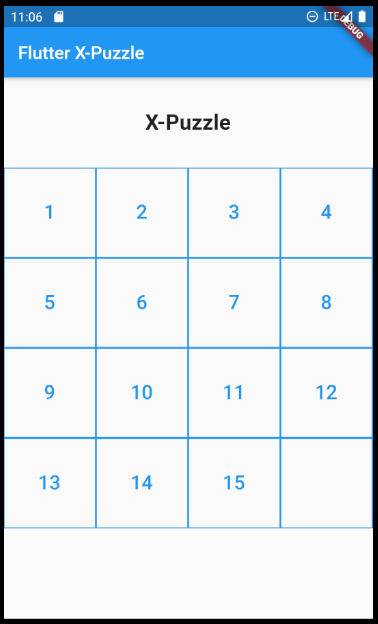
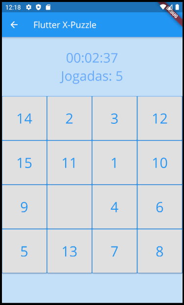
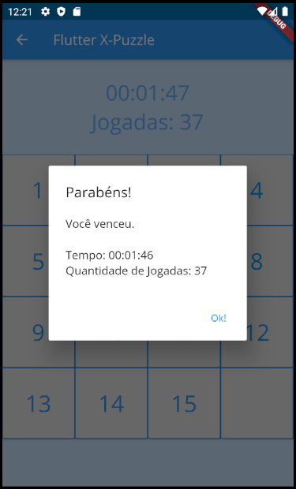

# xPuzzle

> Implementação do [15-puzzle](https://en.wikipedia.org/wiki/15_puzzle), feita em Flutter. O objetivo do jogo é ordenar os números dentro do quadrado.

## **Funcionalidades**
  - Múltiplas opções de dificuldade
  - Contador de tempo de jogo e de jogadas feitas

## **Instalação**

Versão pré-compilada:
  - Faça o download do APK correspondente à arquitetura do dispositivo, disponibilizado nas [releases](https://github.com/maaamorim/xPuzzle/tree/master/releases) desse repositório
  - Instale o APK no dispositivo

Compilar a partir do código (Linux):
  - Baixe o código fonte desse repositório a partir do [arquivo zip](https://github.com/maaamorim/xPuzzle/archive/master.zip) ou do comando `git clone https://github.com/maaamorim/xPuzzle.git`
  - Acesse o novo repositório a partir de `cd xPuzzle`
  - Digite o comando `flutter build apk --split-per-abi`. Após a execução, os APKs estarão disponibilizados no diretório `build/app/outputs/apk/release/`

## **Telas**

### Principal

Contém o seletor de dificuldade e o botão de iniciar o jogo. As possíveis dificuldades são:
  - Fácil (3x3)
  - Normal (4x4)
  - Difícil (5x5)
  - Hardcore (6x6)

### Jogo

Além de disponibilizar o tabuleiro de jogo, mostra quanto tempo a partida está durando e a quantidade de jogadas feitas.

Quando o jogo é vencido, a seguinte notificação aparece e o usuário é redirecionado para a tela principal.

